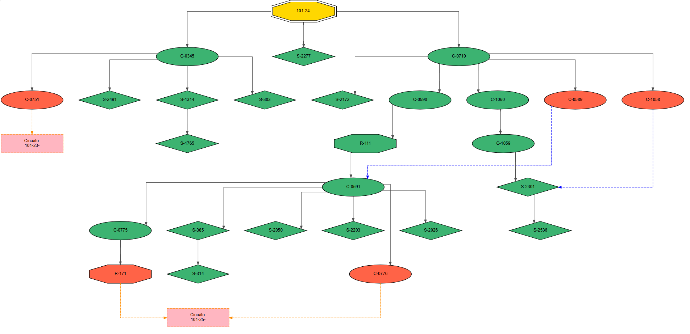

# Barrido Eléctrico Iterativo - DFS

## Descripción General

Este repositorio contiene una implementación en Python de un **barrido eléctrico iterativo** para el análisis de redes de distribución eléctrica. El sistema procesa datos sobre circuitos, elementos de corte (ECs), líneas y transformadores para determinar la conectividad, identificar componentes energizados y detectar anillos o transferencias entre circuitos. Los resultados se visualizan como grafos dirigidos en formato SVG, representando la topología de cada circuito.

El código está diseñado para ser flexible, soportando la carga de datos desde archivos CSV o bases de datos Oracle, e incluye funcionalidades robustas de validación, procesamiento y visualización de datos. El caso de uso principal es el análisis de redes de distribución eléctrica para la Empresa de Energía del Quindío (EDEQ).

## Estructura del Repositorio

El repositorio está organizado en los siguientes archivos principales:

- **`main.py`**: Script principal que orquesta todo el proceso, desde la carga de datos hasta la ejecución del barrido eléctrico y la generación de grafos.
- **`Data_process.py`**: Gestiona la carga de datos desde fuentes CSV o Oracle, con validación y preprocesamiento de los dataframes.
- **`barrido_electrico.py`**: Contiene la lógica central del barrido eléctrico iterativo y el análisis de anillos.
- **`visualizacion_grafos.py`**: Genera grafos dirigidos en formato SVG para visualizar las topologías de los circuitos.
- **Archivos de Datos**:
  - `Data/CSV/`: Directorio para archivos CSV de entrada (`circuitos.csv`, `elementos_corte.csv`, `Lineas.csv`, `transformadores.csv`).
  - `Data/SQL/`: Directorio para archivos de consultas SQL (`elementos_corte.sql`, `Lineas.sql`, `transformadores.sql`) para acceso a bases de datos Oracle.

## Funcionalidad

El sistema realiza las siguientes tareas de alto nivel:

1. **Carga y Preprocesamiento de Datos** (`Data_process.py`):
   - Carga datos de circuitos, elementos de corte (ECs), líneas y transformadores desde archivos CSV o una base de datos Oracle.
   - Valida las columnas requeridas y aplica conversiones de tipos de datos (por ejemplo, eliminación de espacios en cadenas, conversión a mayúsculas).
   - Asegura la consistencia de los datos manejando valores nulos y formatos esperados.

2. **Barrido Eléctrico Iterativo** (`barrido_electrico.py`):
   - Ejecuta una búsqueda en profundidad (DFS) para rastrear la conectividad eléctrica desde el interruptor principal de un circuito.
   - Identifica componentes energizados (ECs, líneas, transformadores) según el estado de los elementos de corte (ABIERTO o CERRADO).
   - Realiza un barrido secundario para detectar anillos o transferencias analizando los elementos de corte en estado ABIERTO.
   - Acumula los resultados en dataframes con relaciones jerárquicas (por ejemplo, equipo padre, elementos aguas arriba).

3. **Visualización de Grafos** (`visualizacion_grafos.py`):
   - Genera grafos dirigidos para cada circuito usando Graphviz, guardados como archivos SVG.
   - Representa los elementos de corte como nodos con formas y colores según su tipo y estado.
   - Muestra las conexiones (aristas) entre elementos, destacando los anillos con líneas discontinuas.

4. **Ejecución Principal** (`main.py`):
   - Coordina todo el flujo de trabajo, desde la carga de datos hasta la generación de resultados y visualizaciones.
   - Permite configurar las fuentes de datos (CSV u Oracle) y guardar opcionalmente los resultados en un archivo Excel.
   - Registra el tiempo de ejecución y proporciona retroalimentación sobre el progreso.

## Lógica del Barrido Eléctrico Iterativo

El barrido eléctrico iterativo está diseñado para modelar la conectividad y el estado de energización de una red de distribución eléctrica. El proceso consta de dos fases principales: **barrido de conectividad** y **análisis de anillos**.

### Fase 1: Barrido de Conectividad

El barrido de conectividad utiliza un algoritmo de búsqueda en profundidad (DFS) para rastrear el camino eléctrico desde el interruptor principal de un circuito (identificado por `CODIGO_OPERATIVO` en los datos del circuito). La lógica se implementa en la función `barrido_conectividad_por_circuito` en `barrido_electrico.py`. A continuación, se detalla su funcionamiento:

1. **Inicialización**:
   - El barrido comienza en el interruptor principal del circuito, identificado al coincidir el `CODIGO_OPERATIVO` del circuito en el dataframe de elementos de corte (`df_elementos_corte_global`).
   - Se utiliza una pila (`pila_exploracion`) para gestionar el DFS, empezando por el segundo nodo (`NODO2_ID`) del interruptor principal.

2. **Exploración**:
   - Para cada elemento en la pila (un elemento de corte o una línea), el algoritmo:
     - Identifica las líneas conectadas mediante `NODO1_ID` o `NODO2_ID`.
     - Añade las líneas a los resultados (`resultados_lineas_global_lista`) con su elemento de corte padre y el camino aguas arriba.
     - Busca transformadores conectados a los nodos de la línea y los añade a los resultados (`resultados_transformadores_global_lista`).
     - Identifica los elementos de corte (ECs) conectados y los procesa según su estado:
       - **CERRADO**: Continúa el barrido por el nodo opuesto (`NODO1_ID` o `NODO2_ID`), añadiendo el EC a los resultados y actualizando el camino aguas arriba.
       - **ABIERTO**: Marca el EC como un posible punto de anillo, registrando el nodo no explorado (`Nodo_No_Explorado_Anillo`) para análisis posterior.
       - **ECs de interconexión**: Si un EC pertenece a un circuito diferente, se trata como ABIERTO para el análisis de anillos, preservando su estado original.

3. **Seguimiento**:
   - Los elementos visitados se rastrean con conjuntos (`visitados_ec_fids_este_circuito`, `visitados_lineas_fids_este_circuito`, `visitados_trafos_fids_este_circuito`) para evitar ciclos dentro del circuito.
   - Los resultados incluyen información jerárquica (`Equipo_Padre`, `Elementos_Aguas_Arriba`, `Circuito_Origen_Barrido`).

4. **Retroalimentación de Progreso**:
   - Una barra de progreso (`print_progress_bar`) muestra el estado del barrido para todos los circuitos, incluyendo el tiempo transcurrido.

### Fase 2: Análisis de Anillos

El análisis de anillos, implementado en `barrido_anillos_especifico` y orquestado en `generar_dfs_resultados_finales`, identifica anillos o transferencias explorando los nodos no explorados de los elementos de corte en estado ABIERTO. La lógica es la siguiente:

1. **Identificación de ECs ABIERTOS**:
   - Para cada circuito, el algoritmo filtra los elementos de corte en estado ABIERTO con un `Nodo_No_Explorado_Anillo` válido en los resultados del barrido de conectividad.
   - Estos ECs son puntos potenciales donde el circuito se conecta con otro circuito (formando un anillo o transferencia).

2. **Exploración**:
   - Se realiza un DFS simplificado desde el nodo no explorado de cada EC ABIERTO.
   - El barrido busca el primer elemento de corte encontrado, que puede pertenecer al mismo circuito (anillo interno) o a un circuito diferente (transferencia).
   - Se atraviesan líneas y ECs CERRADOS, pero solo se registra el primer EC encontrado como el punto final del anillo.

3. **Resultados**:
   - Para cada EC ABIERTO, el algoritmo registra:
     - `Equipo_anillo`: El `CODIGO_OPERATIVO` del EC que cierra el anillo.
     - `Elementos_Aguas_Arriba_anillo`: El camino aguas arriba hasta el EC del anillo.
     - `Circuito_anillo`: El circuito del EC final (mismo o diferente al circuito inicial).
   - Si no se encuentra un EC dentro de un límite máximo de iteraciones (100), el análisis de anillos devuelve `pd.NA` para todos los campos.

4. **Retroalimentación de Progreso**:
   - Una barra de progreso separada rastrea el análisis de anillos para cada circuito.

### Salidas

- **Dataframes**:
  - `df_final_elementos_corte`: Contiene los elementos de corte con información de conectividad y anillos.
  - `df_final_lineas`: Contiene las líneas energizadas con sus ECs padres y caminos aguas arriba.
  - `df_final_trafos`: Contiene los transformadores conectados a líneas energizadas.

- **Visualizaciones**:
  - Se generan grafos dirigidos para cada circuito usando Graphviz, guardados como archivos SVG en el directorio `grafos_circuitos_ecs`.
  - Los nodos representan elementos de corte con formas según su tipo (por ejemplo, diamante para interruptores, elipse para cortacircuitos) y colores según su estado (por ejemplo, verde para CERRADO, rojo para ABIERTO).
  - Las aristas representan conexiones físicas, con líneas discontinuas para anillos (azules para internos, naranjas para externos).

## Requisitos Previos

Para ejecutar el código, asegúrate de instalar las siguientes dependencias:

```bash
pip install pandas graphviz sqlalchemy cx_Oracle colorama
```

Además, Graphviz debe estar instalado en el sistema y añadido al PATH:

- **Windows**: Descarga e instala Graphviz desde [https://graphviz.org/download/](https://graphviz.org/download/) y añade el directorio `bin` al PATH.
- **Linux/Mac**: Instala Graphviz usando el administrador de paquetes (por ejemplo, `sudo apt-get install graphviz` en Ubuntu).

Para el acceso a bases de datos Oracle, asegúrate de tener instaladas y configuradas las bibliotecas cliente de Oracle.

## Uso

1. **Configurar Fuentes de Datos**:
   - Edita `main.py` para establecer `DATA_LOAD_METHOD` en `"CSV"` o `"oracle"`.
   - Actualiza las rutas de los archivos CSV o SQL en los directorios `Data/CSV/` o `Data/SQL/`.
   - Para Oracle, verifica los detalles de conexión (usuario, contraseña, host, puerto, nombre del servicio) en `Data_process.py`.

2. **Ejecutar el Script**:
   ```bash
   python main.py
   ```

3. **Salidas**:
   - **Dataframes**: Los resultados se almacenan en memoria y pueden guardarse en un archivo Excel (`resultados_barrido_electrico_final.xlsx`) si `Guardar_resultados` está configurado como `True`.
   - **Grafos**: Los archivos SVG se generan en el directorio `grafos_circuitos_ecs`, uno por cada circuito.

## Ejemplo de Resultados
### Ejemplo del DF final de los equipos de corte
| G3E_FID  | CIRCUITO | CODIGO_OPERATIVO | EST_ESTABLE | Equipo_Padre | Elementos_Aguas_Arriba             | Equipo_anillo | Elementos_Aguas_Arriba_anillo                | Circuito_anillo |
|----------|----------|------------------|-------------|--------------|-----------------------------------|---------------|---------------------------------------------|-----------------|
| 30748671 | 111-24-  | S-1871           | CLOSED      | C-0658       | 111-24-,C-0180,C-0276,C-0658      |               |                                             |                 |
| 47047337 | 111-24-  | C-0983           | OPEN        | C-0658       | 111-24-,C-0180,C-0276,C-0658      | C-0984        | 111-24-,C-0180,C-0276,C-0658,C-0982,R-235   | 111-24-         |
| 47047332 | 111-24-  | C-0982           | CLOSED      | C-0658       | 111-24-,C-0180,C-0276,C-0658      |               |                                             |                 |
| 47047319 | 111-24-  | R-235            | CLOSED      | C-0982       | 111-24-,C-0180,C-0276,C-0658,C-0982 |               |                                             |                 |
| 47047327 | 111-24-  | C-0984           | CLOSED      | R-235        | 111-24-,C-0180,C-0276,C-0658,C-0982,R-235 |               |                                             |                 |

### Ejemplo del DF final de las líneas eléctricas
| G3E_FID  | CIRCUITO | TENSION | Equipo_Padre | Elementos_Aguas_Arriba             |
|----------|----------|---------|--------------|-----------------------------------|
| 48263495 | 111-24-  | 13.2    | C-0180       | 111-24-,C-0180                    |
| 48263614 | 111-24-  | 13.2    | C-0180       | 111-24-,C-0180                    |
| 30745695 | 111-24-  | 13.2    | C-0276       | 111-24-,C-0180,C-0276             |
| 47201602 | 111-24-  | 13.2    | S-2463       | 111-24-,C-0180,C-0276,S-2463      |
| 47199053 | 111-24-  | 13.2    | S-2463       | 111-24-,C-0180,C-0276,S-2463      |

### Ejemplo del DF final de los transformadores
| G3E_FID  | CODIGO   | CIRCUITO | TENSION | Linea_Conexion_FID | Elementos_Aguas_Arriba             | Equipo_Padre_Linea |
|----------|----------|----------|---------|--------------------|-----------------------------------|--------------------|
| 47199184 | ARUN2729 | 111-24-  | 13.2    | 47199200           | 111-24-,C-0180,C-0276,S-2463      | S-2463             |
| 46671672 | ARRN0923 | 111-24-  | 13.2    | 46671678           | 111-24-,C-0180,C-0276             | C-0276             |
| 30748914 | ARRN0880 | 111-24-  | 13.2    | 30746039           | 111-24-,C-0180,C-0276             | C-0276             |
| 30748976 | ARUN2597 | 111-24-  | 13.2    | 30746043           | 111-24-,C-0180,C-0276,S-1902,S-2281 | S-2281             |
| 30748959 | ARRN0876 | 111-24-  | 13.2    | 30746000           | 111-24-,C-0180,C-0276,S-1902      | S-1902             |


## Ejemplo de Visualizaciones


En el diagrama se puede visualizar el circuito `101-24` y la multiples conexiones aguas abajo que posee, dependiendo de la forma se identifica si el elemento de corte 'EC' es tipo: Cuchilla, seccionador, reconectador, y se visualizan los anillos internos que se forman, por ejemplo entre `C-0589` y `C-0591`, y los anillos con otros circuitos, por ejemplo con el circuito `101-25` que se realiza a traves de la cuchilla `C-0776` o el reconectador `R-171`.

## Personalización

- **Apariencia de los Grafos**: Modifica los parámetros en `generar_grafo_circuito` (por ejemplo, `font_size`, `node_width`, `line_thickness`, colores) para personalizar la salida SVG.
- **Fuentes de Datos**: Ajusta `source_types` en `main.py` para combinar entradas CSV y Oracle.
- **Verbosidad**: Configura `verbose_mode=True` en `main.py` para obtener registros detallados durante el barrido y el análisis de anillos.

## Notas

- El código asume que los datos de entrada están bien formados y contienen las columnas requeridas. Los datos faltantes o inconsistentes generarán mensajes de error y detendrán la ejecución.
- El análisis de anillos está limitado a 100 iteraciones por EC ABIERTO para prevenir bucles infinitos en topologías complejas.
- Colorama es opcional para colorear la barra de progreso; el script incluye un respaldo si no está instalado.

## Licencia

Este proyecto es para uso interno de EDEQ y no está licenciado para distribución pública.

## Contacto

Para preguntas o soporte, contacta al mantenedor del repositorio en [Zarcasmo Profile](https://github.com/Zarcasmo)